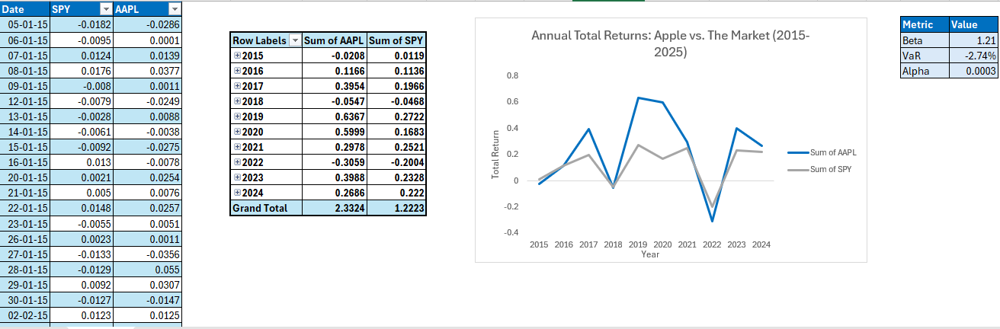

# End-to-End Risk Analytics Pipeline 📊

Hi there! Welcome to my portfolio project.

I built this project because I wanted to bridge the gap between raw data and actionable actuarial insights. Instead of just running a model in a vacuum, I created a full pipeline: taking messy raw data, cleaning it with Python, running actuarial reserving models in R, and finally presenting the results in an interactive Excel dashboard.

It simulates a real-world workflow where data engineering, statistical modeling, and business reporting all have to talk to each other.

## 🚀 The Workflow

Here is how the data flows through this project:

1.  **Python:** I used Python to ingest the raw claims data. This stage handles the ETL (Extract, Transform, Load) process
2.  **R:** Once the data was clean, I moved it to R. Here, I applied linear regression to understand the correlation between the stock and The Market
3.  **Excel (The Face):** Finally, I exported the results to Excel to build a dynamic dashboard. Reporting the Value at Risk (VarR), Beta and Alpha values

---

## 📸 Dashboard Preview

Here is a look at the final output. You can download the fully interactive Excel file below.

### 📥 [Download the Excel Dashboard](3_Excel_Output/Risk_Dashboard.xlsx)
*(Click the link above to view the actual file located in the `3_Dashboard` folder)*

---

## 📂 Repository Structure

Here is what you will find inside the folders:

| Folder | Description |
| :--- | :--- |
| **`0_Data/`** | Contains the raw datasets used for the analysis and the processed CSVs generated after cleaning. |
| **`1_Python_Scripts/`** | The Python notebooks/scripts used for ETL. This is where the raw data is transformed into development triangles. |
| **`2_R_Modelling/`** | The R scripts containing the actuarial algorithms. This includes the Chain Ladder projections and reserve calculations. |
| **`3_Dashboard/`** | The final destination. Contains the interactive Excel dashboard and screenshots of the analysis. |

---

## 🛠 Tools & Tech Stack

*   **Python:** Pandas, NumPy (for data manipulation)
*   **R:** ChainLadder package (for stochastic modeling)
*   **Excel:** Advanced formulas, Pivot tables, and Slicers (for reporting)

---

## 📬 Contact

If you have any questions about the methodology or just want to chat about risk analytics, feel free to reach out!
